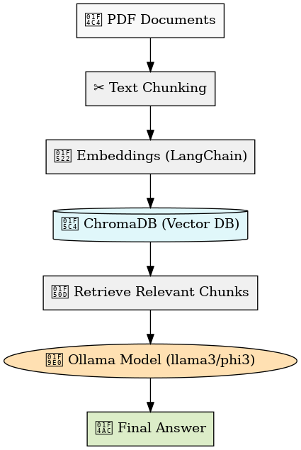

# 📚 Agentic RAG with Ollama (Offline Chatbot)

This project is an **offline Retrieval-Augmented Generation (RAG) pipeline** that allows you to query your own documents (PDFs, text files, etc.) using **local LLMs via Ollama**.  
It works completely **offline**, ensuring privacy and no API costs.  

---

## ⚡ Features
- 🔒 **Fully offline** – no internet or API key required.  
- 📂 **PDF ingestion** – load documents into a vector database.  
- 🔍 **Semantic search with ChromaDB** – retrieves relevant context.  
- 🧠 **Local LLM inference** – powered by [Ollama](https://ollama.com).  
- 🔄 **Customizable models** – easily switch between `llama3`, `phi3`, or others.  
- 💬 **Interactive Q&A** – ask questions about your documents in natural language.  

---

## 🛠️ Prerequisites
Before running this project, install the following:

1. **Python** ≥ 3.10  
2. **Ollama** installed → [Download here](https://ollama.com/download)  
   - After installation, pull a model, e.g.:  
     ```bash
     ollama pull phi3:3.8b
     ```
     or  
     ```bash
     ollama pull llama3:8b
     ```
3. **Pip requirements**:  
   ```bash
   pip install -r requirements.txt
   ```

---

## 📂 Project Structure
```
agentic-rag-free/
│── app.py              # Main chatbot app
│── ingest.py           # Script to load & process PDFs into ChromaDB
│── requirements.txt    # Dependencies
│── .venv/              # Virtual environment (optional)
│── .chroma/            # Local ChromaDB persistence
│── data/               # Place your PDF/text files here
│── README.md           # Documentation
```

---

## 🚀 Usage

### 1. Clone repo & setup environment
```bash
git clone https://github.com/<your-username>/agentic-rag-free.git
cd agentic-rag-free
python -m venv .venv
source .venv/bin/activate   # (Linux/Mac)
.venv\Scripts\activate      # (Windows)
pip install -r requirements.txt
```

### 2. Add documents
Put your PDFs/text files into the `data/` folder. Example:
```
data/
 └── sample.pdf
```

### 3. Ingest documents
This step converts documents into embeddings & stores them in **ChromaDB**:
```bash
python ingest.py
```

### 4. Run chatbot
```bash
python app.py
```

You can now **ask questions** and get context-aware answers using your offline LLM.

---

## 🔄 Switching Models
By default, the app uses **llama3**.  
To switch to **phi3:3.8b**, edit `app.py`:

```python
# Change model name
model="phi3:3.8b"
```

Then re-run:
```bash
python app.py
```

---

## 🖼️ Architecture
Here’s how the flow works:



---

## 📌 Example
1. Place a **research paper PDF** inside `data/`.  
2. Run `python ingest.py`.  
3. Ask:
   ```
   Q: Summarize section 2 of my PDF.
   A: ...
   ```

---

## 📦 Requirements
- chromadb==0.5.5  
- langchain>=0.2.0  
- pypdf  
- ollama  
- python-dotenv  

(Already listed in `requirements.txt`)  

---

## 🙌 Contributing
Feel free to fork, open issues, or submit PRs.  

---

## 📜 License
MIT License – free to use, modify, and share.  
